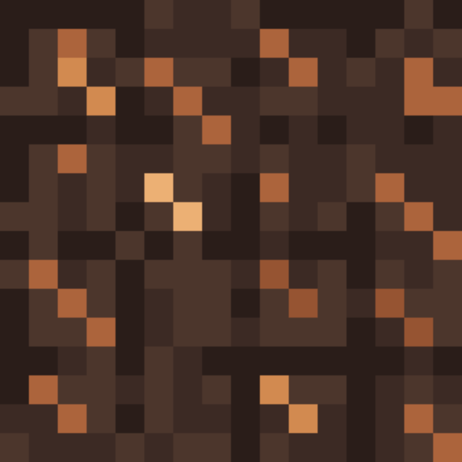

# SoftMagma

SoftMagma is a Minecraft resource pack for version 1.21.11 created by fir3.
It provides a softer, darker magma block texture while keeping the original
animated magma effect.

## Features

- Replaces the default magma block texture.
- Includes six animation frames.
- Uses a four-tick frame time.
- Keeps animation interpolation disabled for a pixel-art style.

## Compatibility

- Minecraft: 1.21.11
- Pack format: 42

## Installation

1. Download `SoftMagma.zip`.
2. Open Minecraft and go to **Options → Resource Packs**.
3. Select **Open Pack Folder**.
4. Place `SoftMagma.zip` in the resource-pack folder.
5. Enable **SoftMagma** in the available resource packs.

## Project structure

- `pack.mcmeta` — resource-pack metadata.
- `pack.png` — pack icon.
- `magma_flow_preview.gif` — animated preview for GitHub and other Markdown viewers.
- `assets/minecraft/textures/block/magma.png` — animated magma texture.
- `assets/minecraft/textures/block/magma.png.mcmeta` — animation configuration.